# Mapping Earthquakes

This project utilized the Leaflet.js API in JavaScript to create an interactive map showing earthquake data for the past seven days. The map was created and styled using Leaflet tiles and Mapbox APIs. Earthquake data in GeoJSON format was pulled from the United States Geological Survey (USGS) website and used to plot the data. GeoJSON data corresponding to the Earth's tectonic plates was also downloaded from https://github.com/fraxen/tectonicplates to plot outlines of the Earth's tectonic plates on the map.

## HTML Code
The HTML code to generate the map is relatively straightforward and shown in Fig. 1.

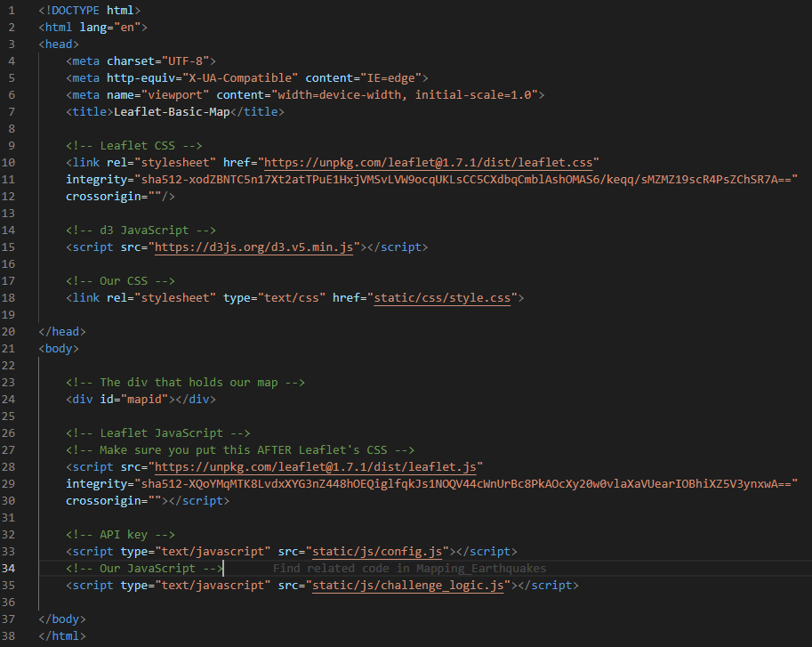

*Figure 1. Earthquake map HTML*

Lines 10-12 and 18 in the head of the HTML file link to the Leaflet CSS and the CSS written for this project, respectively. The d3 JavaScript file is embedded in the head section to make the map interactive. The body section of the HTML file contains the div tag which holds the map, as well as script tags which embed the Leaflet JavaScript file, the config JavaScript file containing the Mapbox API key, and the logic JavaScript file where the map interactivity is coded.

## CSS Code
The CSS code contains styling for the map as well as the legend as shown in Fig. 2. Lines 1-7 in Fig. 2 ensure the map occupies the full screen, and lines 10-23 set the style for the legend.

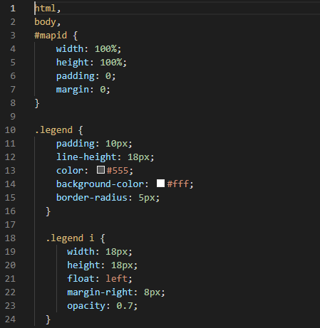

*Figure 2. Earthquake map CSS*

## JavaScript Code
The logic JavaScript file basically contains the brains of the interactive map. To create the tiles for the different map views, three Leaflet tile layers are created using Mapbox APIs and added to the *baseMaps* array as shown in Fig. 3. Note that each tile corresponds to a selectable view in the final map. This is illustrated in the Earthquake Map section of this README.

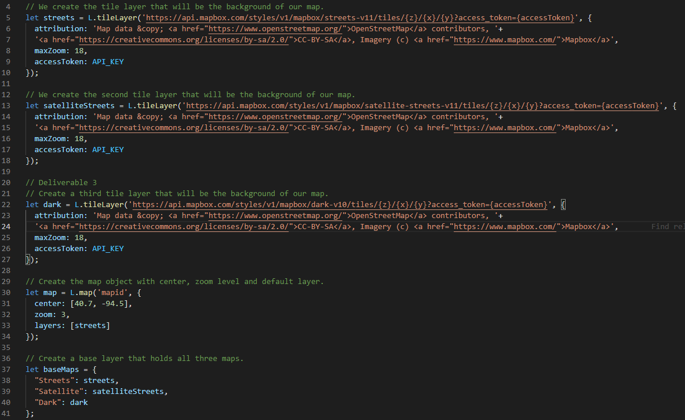

*Figure 3. Earthquake map JavaScript Leaflet tile layers*

Three selectable overlays are also created as shown in Fig. 4. These overlays can be turned on or off in the map.

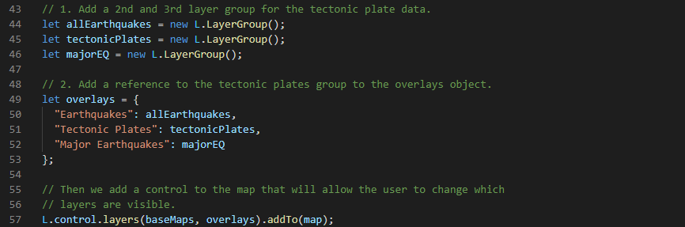

*Figure 4. Earthquake map JavaScript overlays*

The d3.json() callback is used to retrieve the earthquake data from the USGS website and plot all earthquakes occuring within the last seven days. This code is shown in Fig. 5.

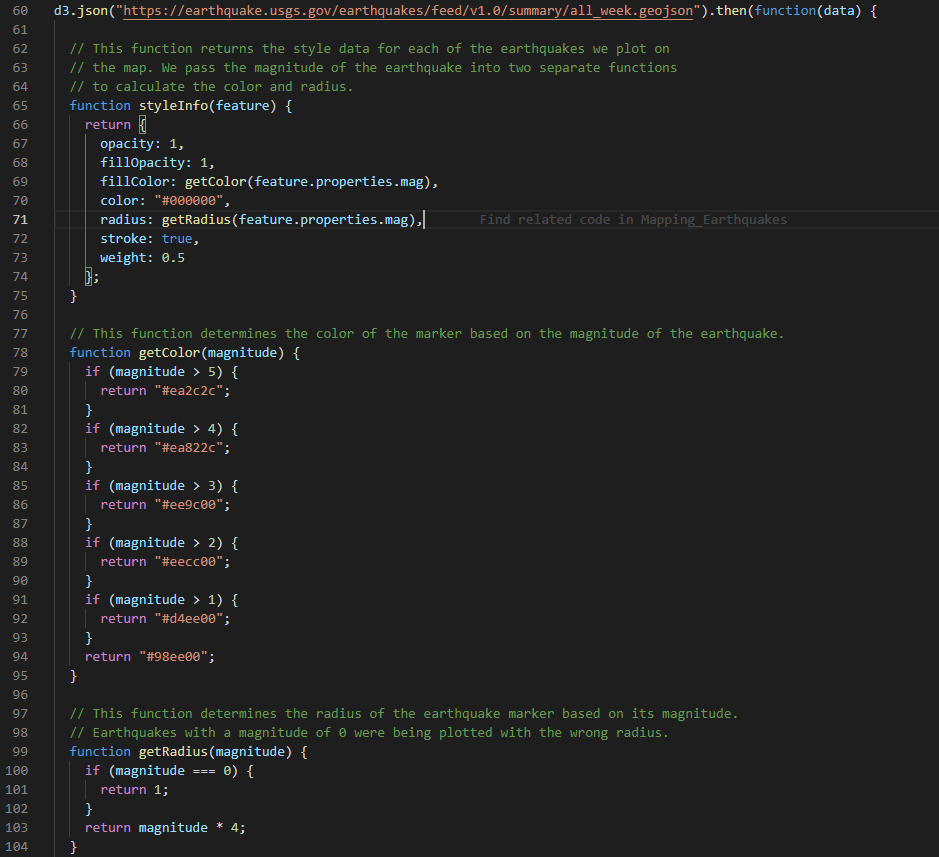

*Figure 5. Earthquake map JavaScript d3.json() callback*

The three functions, *styleInfo()*, *getColor()*, and *getRadius()* correspond to the circle markers that are created within the geoJson layer as illustrated in Fig. 6. This code takes in the GeoJSON data, plots each point with a circle marker with size and color corresponding to the magnitude, styles the marker, adds a popup to each marker, and adds it to the *allEarthquakes* layer from Fig. 4.

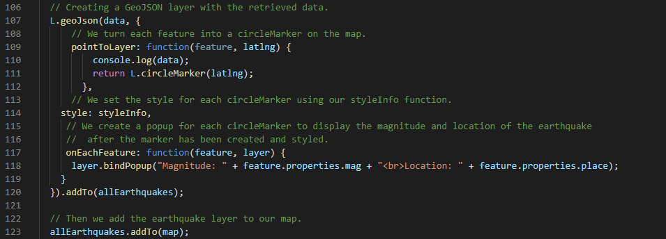

*Figure 6. Earthquake map JavaScript create geoJson layer*

In a similar manner, earthquakes with a magnitude of 4.5 or greater occuring within the last seven days are added to another layer, *majorEQ*, with respect to Fig. 4. The code to add the major earthquakes to the *majorEQ* layer is shown in Figs. 7 and 8.

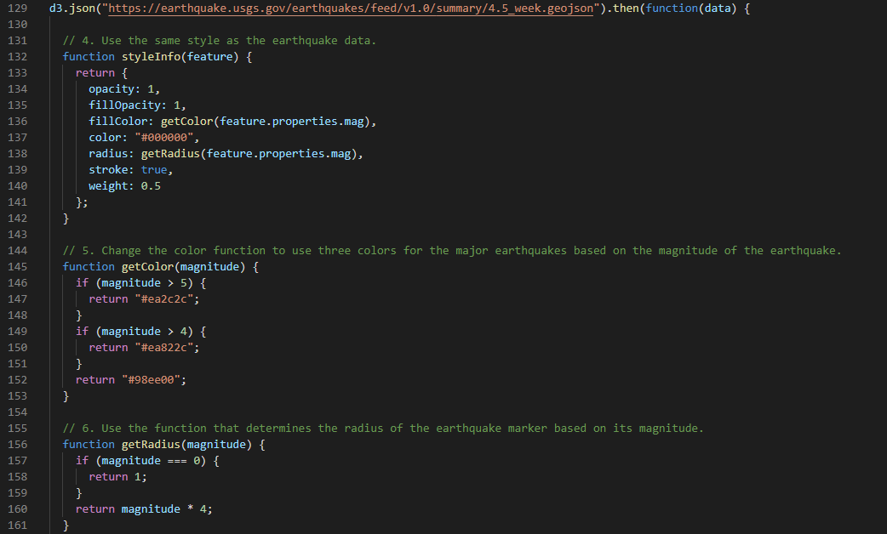

*Figure 7. Earthquake map JavaScript d3.json() callback for major earthquakes*

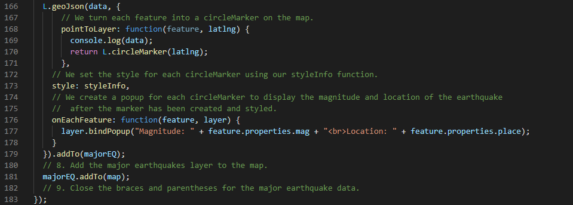

*Figure 8. Earthquake map JavaScript create geoJson layer for major earthquakes*

Line corresponding to the Earth's tectonic plates are also included as a layer in the map with the code shown in Fig. 9.

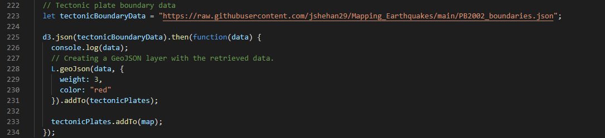

*Figure 9. Earthquake map JavaScript create geoJson layer for tectonic plates*

Finally, the legend is added to the map with the code shown in Fig. 10. Notice that lines 189-204 correspond to Leaflet methods, and the section of code in lines 208-214 adds code to the page HTML to include the colored boxes and text for the legend. Also, recall that the legend box is styled with the CSS file.

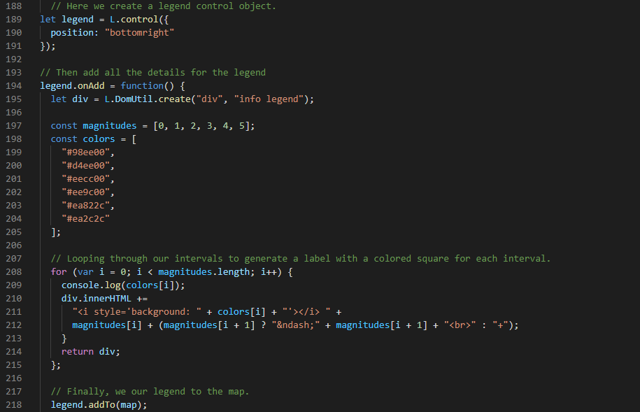

*Figure 10. Earthquake map JavaScript create geoJson layer for tectonic plates*

## Earthquake Map
The resulting map is shown in Figs. 11-16. Fig. 11 shows the default map that displays when the page is loaded. The map uses the streets view from Mapbox, and all earthquakes (including major earthquakes) occuring in the last seven days as well as Earth's tectonic plates are shown on the map.

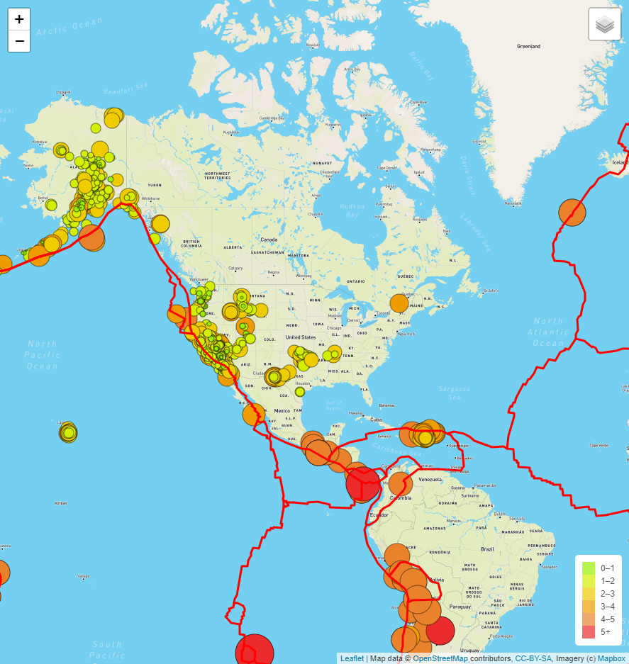

*Figure 11. Default earthquake map with streets view, all earthquakes, and Earth's tectonic plates*

The map in Fig. 12 turns off the major earthquake layer and the tectonic plates layer so that all earthquakes occuring in the last seven days are plotted.

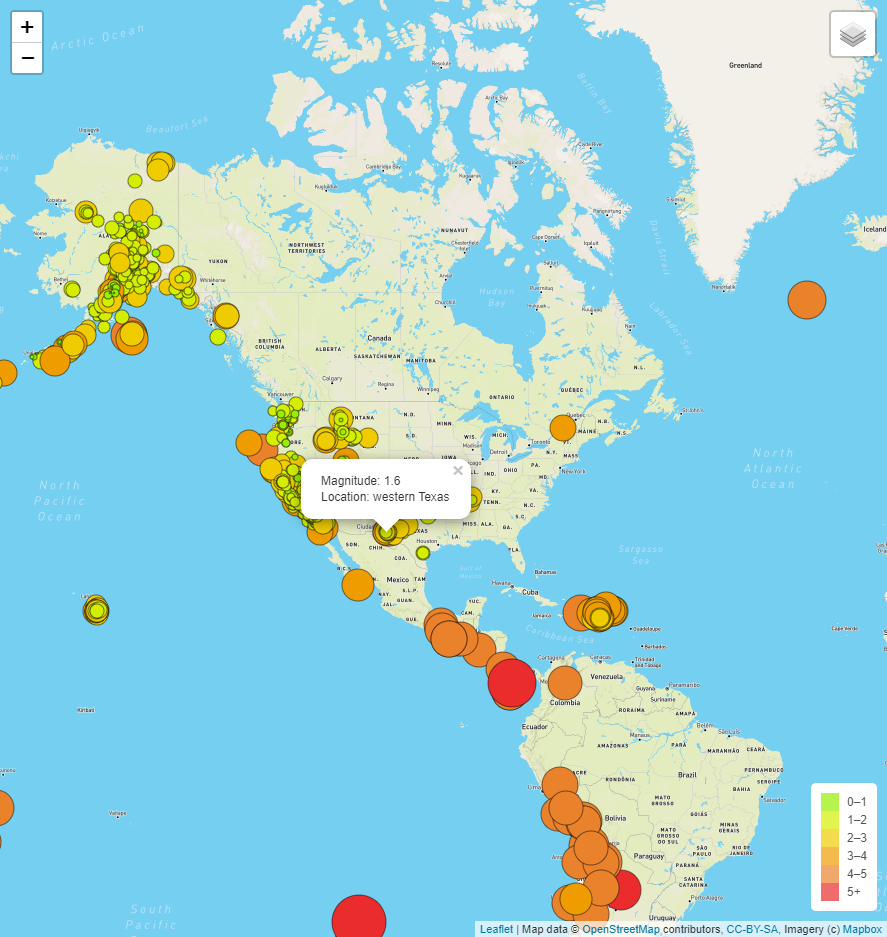

*Figure 12. Default earthquake map with streets view and all earthquakes occuring within the last seven days plotted*

The map in Fig. 13 turns off the layer containing all earthquakes as well as the tectonic plates layer so that only the major earthquakes occuring within the last seven days are plotted.

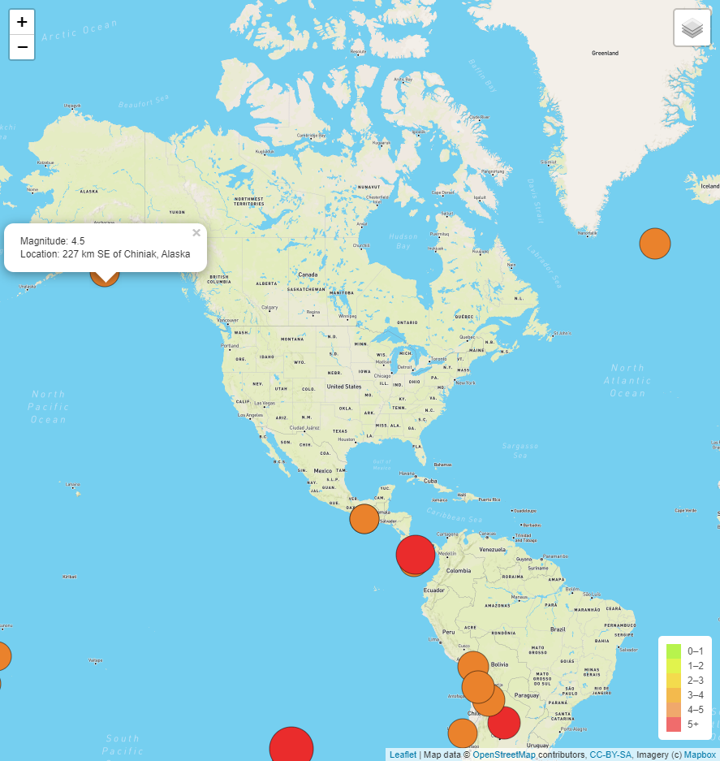

*Figure 13. Default earthquake map with streets view and only major earthquakes occuring in the last seven days plotted*

The map in Fig. 14 turns off the earthquake layers and only plots Earth's tectonic plates.

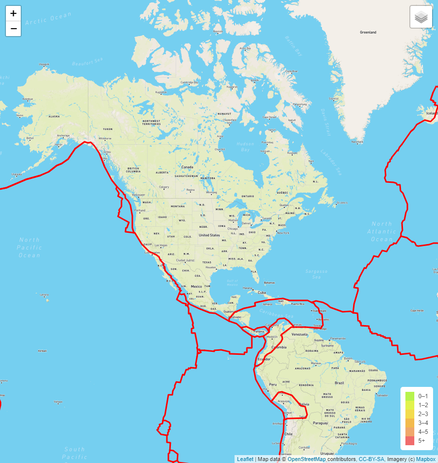

*Figure 14. Default earthquake map with streets view and Earth's tectonic plates*

The maps in Figs. 15 and 16 show the map with all layers turned on and the satellite and dark tiles selected, respectively. Note that other tile layers could be added by simply including more APIs to the Mapbox styles.

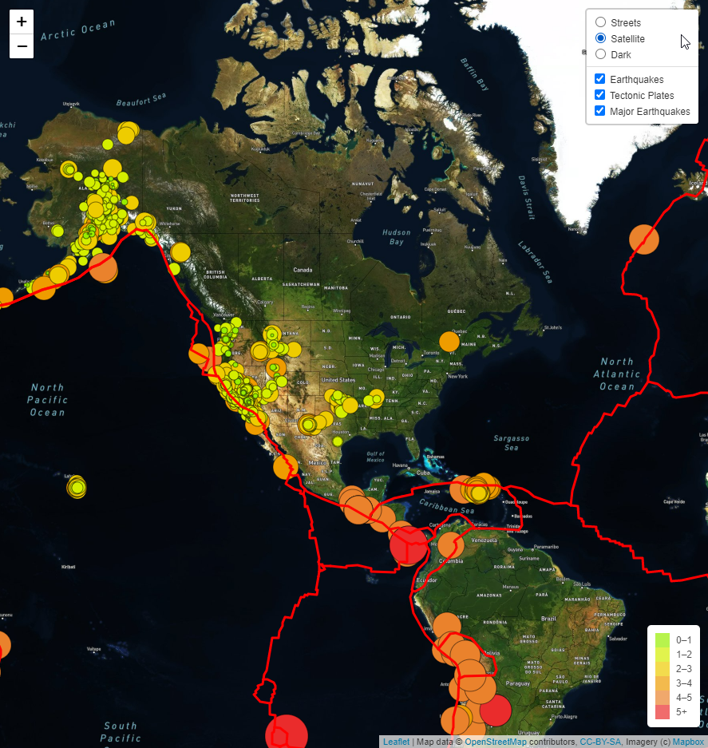

*Figure 15. Default earthquake map with satellite view, all earthquakes, and Earth's tectonic plates*

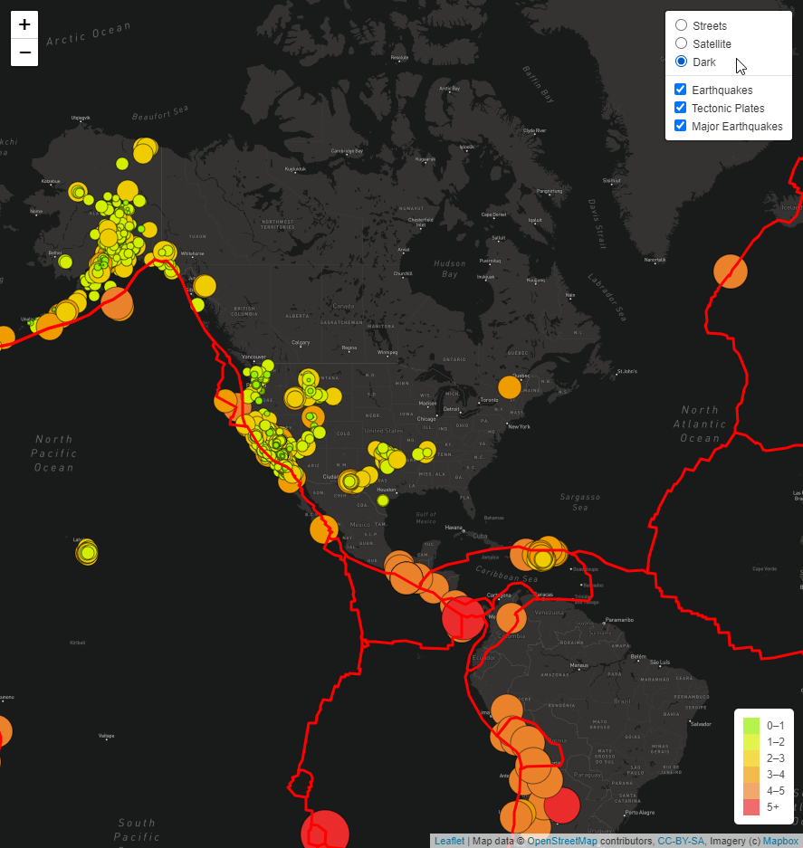

*Figure 16. Default earthquake map with dark view, all earthquakes, and Earth's tectonic plates*